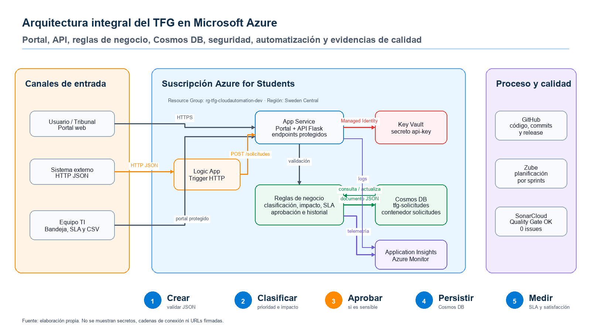
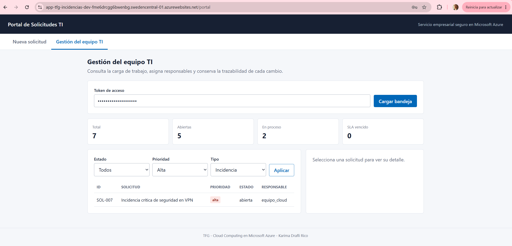
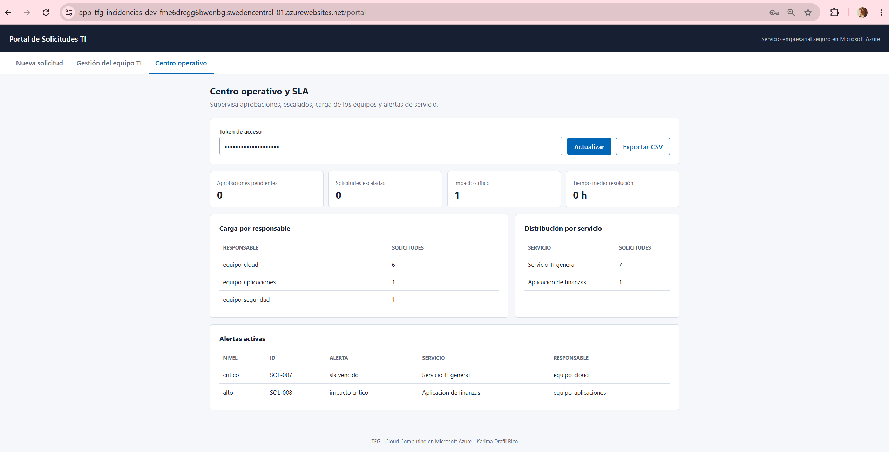
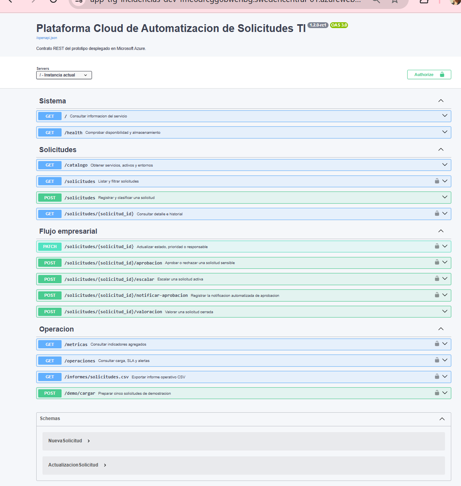
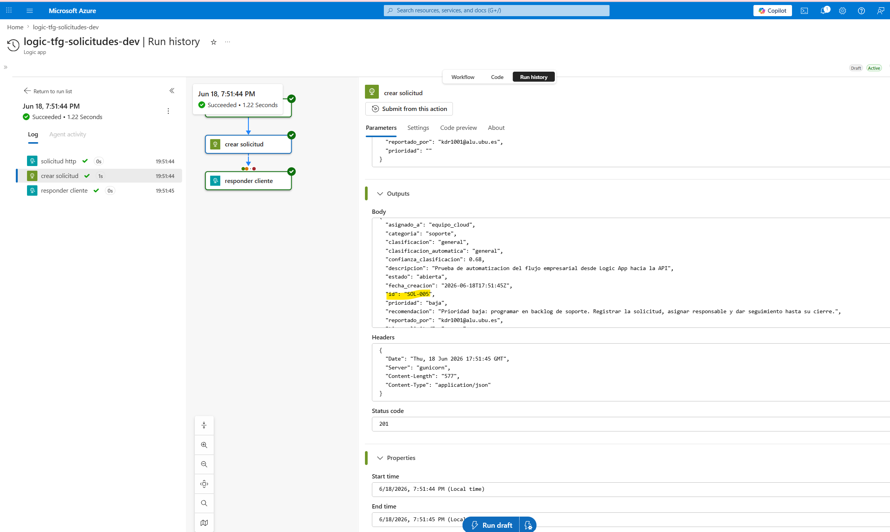

# Plataforma de Automatización de Solicitudes TI en Azure

**Autora:** Karima Drafli Rico  
**Titulación:** Grado en Ingeniería Informática Online, Universidad de Burgos  
**Título:** Cloud Computing: Análisis, Diseño y Despliegue de un Servicio Empresarial Seguro en Microsoft Azure

Este repositorio contiene el prototipo funcional desarrollado para el Trabajo Fin de Grado. La solución aborda un problema habitual en entornos empresariales: la gestión dispersa de solicitudes internas de TI, credenciales, aprobaciones, prioridades y evidencias de seguimiento.

Para estudiar este problema se ha desarrollado una plataforma cloud desplegada en Microsoft Azure. El sistema permite registrar solicitudes, clasificarlas automáticamente mediante reglas explicables, asignar prioridad e impacto, gestionar aprobaciones, controlar SLA, conservar historial, exportar información operativa y aceptar entradas desde sistemas externos mediante una Logic App.

La solución no pretende sustituir a una plataforma ITSM comercial, sino demostrar de extremo a extremo el análisis, diseño, implementación, despliegue, validación y documentación de un servicio empresarial seguro en Microsoft Azure.



## Enlaces de evaluación

| Recurso | Enlace |
|---------|--------|
| Repositorio GitHub | https://github.com/karimadrico/tfg-azure-servicio-empresarial-seguro |
| Portal desplegado | https://app-tfg-incidencias-dev-fme6drcgg6bwenbg.swedencentral-01.azurewebsites.net/portal |
| API desplegada | https://app-tfg-incidencias-dev-fme6drcgg6bwenbg.swedencentral-01.azurewebsites.net |
| Estado de la API | https://app-tfg-incidencias-dev-fme6drcgg6bwenbg.swedencentral-01.azurewebsites.net/health |
| Ayuda integrada | https://app-tfg-incidencias-dev-fme6drcgg6bwenbg.swedencentral-01.azurewebsites.net/ayuda |
| Documentación OpenAPI | https://app-tfg-incidencias-dev-fme6drcgg6bwenbg.swedencentral-01.azurewebsites.net/docs |
| Zube, sprints y Kanban | https://zube.io/tfg-azure-servicio-empresarial/tfg-servicio-empresarial-seguro/w/workspace-1/kanban |
| SonarCloud | https://sonarcloud.io/project/overview?id=karimadrico_tfg-azure-servicio-empresarial-seguro |
| Release v1.1.0 | https://github.com/karimadrico/tfg-azure-servicio-empresarial-seguro/releases/tag/v1.1.0 |

Las operaciones públicas permiten registrar solicitudes y consultar la ayuda. Las operaciones internas del equipo TI requieren token Bearer; el token de evaluación se facilita en el PDF de enlaces entregado en UBUVirtual y corresponde al secreto `api-key` almacenado en Azure Key Vault.

## Demostración funcional

El portal permite registrar una solicitud de TI sin acceder directamente a la base de datos ni a secretos internos. La API valida el contenido, consulta el catálogo de servicios, aplica reglas de clasificación y devuelve una solicitud con identificador, prioridad, impacto, responsable, SLA y estado inicial.


El equipo TI trabaja desde una bandeja protegida. Desde ahí puede filtrar solicitudes, revisar el detalle, aprobar o rechazar solicitudes sensibles, escalar incidencias, cerrar trabajos y conservar la trazabilidad de cada cambio.



La solución incorpora un centro operativo para revisar carga de trabajo, SLA vencidos, distribución por responsable, métricas de operación y satisfacción. Esta parte convierte el prototipo en una herramienta demostrable para seguimiento operativo, no solo en un formulario de alta de tickets.



La documentación OpenAPI permite consultar y probar los endpoints principales del servicio. Esto facilita que el tribunal o un equipo técnico pueda entender el contrato de la API sin revisar directamente el código fuente.



La Logic App representa la entrada automática desde otro sistema empresarial. Un formulario corporativo, intranet o herramienta externa puede enviar una solicitud HTTP a la Logic App; esta valida el flujo de integración y llama a `POST /solicitudes` en la API desplegada.



## Arquitectura

La arquitectura final se compone de servicios gestionados de Azure y herramientas de apoyo al proceso de desarrollo:

| Componente | Uso en el TFG |
|------------|---------------|
| Azure App Service | Aloja el portal web y la API Flask. |
| API Flask | Centraliza validación, catálogo, reglas de negocio, clasificación, aprobación, escalado, SLA e historial. |
| Azure Cosmos DB | Conserva cada solicitud como documento JSON independiente en el contenedor `solicitudes`. |
| Azure Key Vault | Almacena el token de autenticación fuera del código fuente. |
| Managed Identity | Permite que App Service acceda a Key Vault sin credenciales cloud embebidas. |
| Azure Logic Apps | Recibe solicitudes desde sistemas externos y llama a `POST /solicitudes`. |
| Application Insights / Azure Monitor | Recoge telemetría básica y facilita la observabilidad del despliegue. |
| Zube | Documenta la planificación ágil por sprints. |
| SonarCloud | Aporta análisis externo de calidad, seguridad, fiabilidad y mantenibilidad. |

## Persistencia con Cosmos DB

La persistencia final utiliza Azure Cosmos DB porque el modelo de datos es documental: cada solicitud contiene datos semiestructurados, historial, aprobación, escalado, SLA y valoración. La primera versión cloud usó Blob Storage con una colección JSON única; la evolución a Cosmos DB mantiene el formato JSON, separa cada solicitud en un documento propio y alinea mejor el prototipo con una solución empresarial real.


La migración se realizó con `scripts/migrate-blob-to-cosmos.ps1`, leyendo las solicitudes existentes desde Blob Storage e insertándolas o actualizándolas en Cosmos DB. Se migraron 20 solicitudes existentes y la última verificación real creó `SOL-023`, dejando 23 solicitudes listadas por la API.

| Elemento Cosmos DB | Valor desplegado |
|--------------------|------------------|
| Cuenta | `cosmos-tfg-kdr-2026` |
| Base de datos | `tfg-solicitudes` |
| Contenedor | `solicitudes` |
| Clave de partición | `/tipo_solicitud` |
| Modo de App Service | `STORAGE_MODE=cosmos` |

## Funcionalidades implementadas

- Portal web para registrar solicitudes de acceso, configuración, soporte e incidencias.
- Catálogo de servicios, activos, entornos, criticidad, propietario técnico y aprobador.
- Clasificación ligera y explicable de solicitudes TI.
- Cálculo de prioridad, impacto, SLA y equipo responsable.
- Bandeja protegida para el equipo TI.
- Aprobación y rechazo de solicitudes sensibles.
- Escalado, cierre y valoración final de solicitudes.
- Historial completo de eventos por solicitud.
- Centro operativo con métricas, SLA, carga y satisfacción.
- Exportación CSV de solicitudes.
- Documentación OpenAPI integrada.
- Logic App para automatizar la entrada desde sistemas externos.
- Persistencia final en Cosmos DB con documentos independientes por solicitud.

## Calidad y validación

El proyecto incluye pruebas automáticas, verificación real en Azure y análisis externo de calidad. El análisis final de SonarCloud se conserva como evidencia de cierre.

| Evidencia | Estado |
|-----------|--------|
| Pruebas automáticas | 27 pruebas superadas con `unittest`. |
| SonarCloud | Quality Gate aprobado en el análisis final documentado. |
| Duplicación | 0,0 % en el análisis de calidad documentado. |
| Seguridad | Endpoints internos protegidos con Bearer token y secreto almacenado en Key Vault. |
| Despliegue | API y portal desplegados en Azure App Service. |
| Persistencia | Cosmos DB Free Tier con base de datos `tfg-solicitudes` y contenedor `solicitudes`. |
| Verificación | `scripts/verify-azure.ps1` comprueba `/health`, creación, listado, métricas y portal. |


## Comprobación técnica

La forma principal de probar la solución es utilizar el portal desplegado y el recorrido funcional anterior. Como apoyo técnico, también se puede comprobar el estado de la API desde PowerShell:

```powershell
Invoke-RestMethod `
  -Uri "https://app-tfg-incidencias-dev-fme6drcgg6bwenbg.swedencentral-01.azurewebsites.net/health"
```

La respuesta debe indicar `estado: ok` y `storage_mode: cosmos`. Las operaciones internas se prueban con el token incluido en el PDF de enlaces de entrega:

```powershell
$env:API_KEY = "<token-de-evaluacion>"

Invoke-RestMethod `
  -Uri "https://app-tfg-incidencias-dev-fme6drcgg6bwenbg.swedencentral-01.azurewebsites.net/solicitudes" `
  -Headers @{ Authorization = "Bearer $env:API_KEY" }
```

## Despliegue en Azure

El despliegue se realiza con PowerShell y Azure CLI. Los scripts configuran App Service, Cosmos DB Free Tier, Storage de apoyo, Key Vault, Managed Identity, variables de entorno y publicación del código. El token no se versiona en GitHub.

```powershell
az login
$env:API_KEY = "<token-de-verificacion>"
.\scripts\deploy-azure.ps1
.\scripts\verify-azure.ps1
```

La Logic App se despliega con:

```powershell
$env:API_KEY = "<token-de-verificacion>"
.\scripts\deploy-logicapp.ps1
```

## Endpoints principales

| Método | Ruta | Descripción |
|--------|------|-------------|
| `GET` | `/` | Información básica del servicio. |
| `GET` | `/portal` | Portal web empresarial. |
| `GET` | `/ayuda` | Guía de uso integrada. |
| `GET` | `/acerca` | Versión, arquitectura y enlaces verificables. |
| `GET` | `/docs` | Documentación OpenAPI interactiva. |
| `GET` | `/openapi.json` | Contrato OpenAPI 3.0. |
| `GET` | `/health` | Estado técnico del sistema. |
| `GET` | `/catalogo` | Catálogo de servicios, activos y entornos. |
| `POST` | `/solicitudes` | Crear solicitud TI. |
| `GET` | `/solicitudes` | Listar solicitudes, protegido con Bearer token. |
| `GET/PATCH` | `/solicitudes/<id>` | Consultar y gestionar una solicitud. |
| `POST` | `/solicitudes/<id>/aprobacion` | Aprobar o rechazar una solicitud sensible. |
| `POST` | `/solicitudes/<id>/escalar` | Escalar una solicitud activa. |
| `POST` | `/solicitudes/<id>/valoracion` | Valorar una solicitud cerrada. |
| `GET` | `/metricas` | Métricas agregadas, protegido con Bearer token. |
| `GET` | `/operaciones` | Carga, alertas, SLA y satisfacción. |
| `GET` | `/informes/solicitudes.csv` | Exportación CSV protegida. |
| `POST` | `/demo/cargar` | Preparar escenario de demostración protegido. |

## Estructura del repositorio

| Ruta | Contenido |
|------|-----------|
| `src/` | API Flask, portal web, clasificador, almacenamiento y configuración. |
| `tests/` | Pruebas automáticas del comportamiento principal. |
| `scripts/` | Scripts de despliegue, migración Blob a Cosmos DB y verificación en Azure. |
| `logicapp/` | Definición del flujo de Logic App. |
| `infra/terraform/` | Infraestructura declarativa documentada en Terraform. |
| `infra/bicep/` | Plantillas Bicep de apoyo/documentación. |
| `memoria/` | Fuentes LaTeX, imágenes y PDF oficiales de memoria y anexos. |
| `docs/api/` | Documentación técnica de API y endpoints. |
| `docs/arquitectura/` | Evidencias y documentación de arquitectura Azure. |
| `docs/calidad/` | Evidencias de SonarCloud y calidad interna. |
| `docs/decisiones/` | Decisiones técnicas justificadas. |
| `docs/despliegue/` | Documentación de despliegue y verificación. |
| `docs/entrega/` | Base del PDF de enlaces y material de defensa. |
| `docs/evidencias/` | Capturas de Azure, portal, API, Logic App, Monitor, Zube, SonarCloud y GitHub. |
| `docs/sprints/` | Detalle de sprints, prioridades, puntos de historia y capturas de Zube. |

## Entregables

| Entregable | Ubicación |
|------------|-----------|
| Memoria | `memoria/memoria.pdf` |
| Anexos | `memoria/anexos.pdf` |
| Código fuente | `src/`, `logicapp/`, `infra/`, `scripts/` |
| Pruebas | `tests/` |
| Evidencias | `docs/evidencias/` |
| PDF de enlaces | Se genera a partir de `docs/entrega/enlaces-tfg.md` cuando estén publicados los dos vídeos. |
| Presentación de defensa | `docs/entrega/presentacion-defensa-tfg.pptx` |
| Cartel A3 | `docs/entrega/cartel-a3.pdf` |
| Release final | `v1.1.0` en GitHub Releases |
| Licencia | `LICENSE` |

Las direcciones de los vídeos, el token de evaluación y las instrucciones finales de acceso se entregan en el PDF de enlaces de UBUVirtual.
