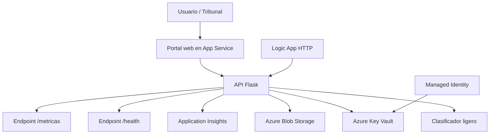
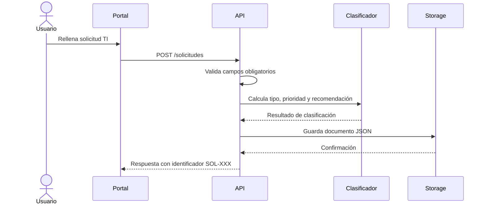
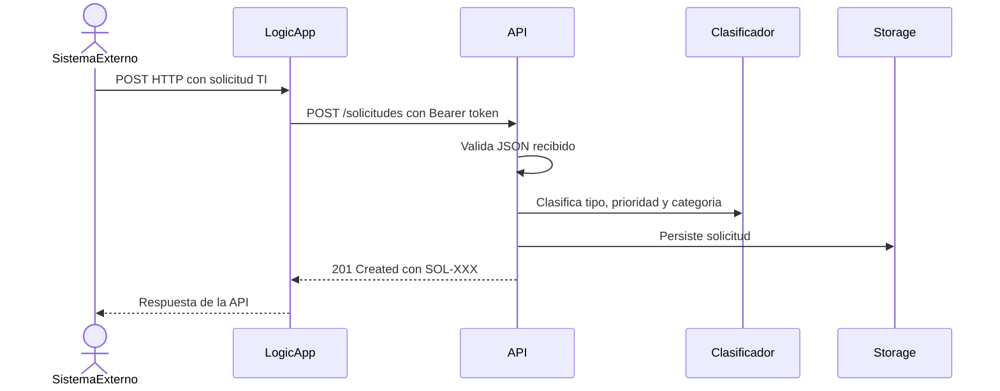
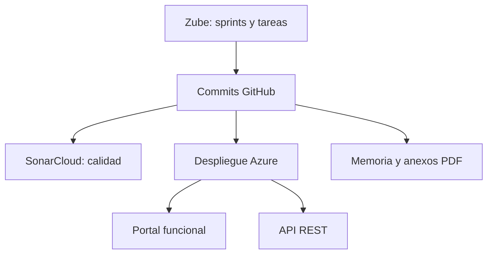

# Diagramas del sistema

Este documento recoge los diagramas que deben acompañar a la memoria y a los anexos del TFG. Los diagramas finales deben ser de elaboración propia y guardarse como PNG en `memoria/img/`, porque esa carpeta es la que se usa desde LaTeX para generar `memoria.pdf` y `anexos.pdf`.

La recomendación es crearlos con diagrams.net/draw.io o con una herramienta de generación visual y revisarlos manualmente antes de incorporarlos al documento. No deben mostrar secretos, tokens, cadenas de conexión ni URLs de Logic App con firma `sig`.

## Diagramas finales a crear

| Archivo final | Donde se usara | Contenido esperado |
|----------------|----------------|--------------------|
| `arquitectura_final_azure.png` | Memoria y Anexo C | Vista completa de la solución: usuario, portal, App Service, API Flask, clasificador ligero, Blob Storage, Key Vault, Managed Identity, Application Insights, Logic App, GitHub, Zube y SonarCloud. |
| `flujo_solicitud_ti.png` | Anexo C y Manual de usuario | Flujo funcional: usuario o Logic App envia solicitud, API valida, clasificador calcula prioridad/categoria, Storage persiste, API devuelve `SOL-XXX`. |
| `despliegue_azure.png` | Anexo D | Flujo de despliegue: repositorio GitHub, scripts PowerShell, Azure CLI, App Service, Key Vault, Storage, Application Insights y script de verificacion. |
| `seguridad_secretos.png` | Memoria y Anexo C | Modelo de seguridad: Key Vault almacena `api-key`, App Service usa Managed Identity, endpoints protegidos con Bearer token, HTTPS y variables de entorno. |
| `calidad_planificacion.png` | Anexo A y Anexo D | Relación entre Zube, commits GitHub, SonarCloud, pruebas automáticas y evidencias de despliegue. |
| `logic_app_workflow.png` | Anexo C o D | Orquestación de Logic App: trigger HTTP, acción HTTP `POST /solicitudes`, respuesta al cliente y almacenamiento final vía API. |
| `observabilidad_monitor.png` | Anexo D | Monitorización: App Service emite métricas/logs, Application Insights recoge telemetría y Azure Monitor permite revisar disponibilidad y errores. |

## Prompt recomendado para ChatGPT Plus

Puedes pedir cada diagrama de forma individual. Ejemplo para el diagrama principal:

```text
Crea un diagrama profesional de arquitectura cloud para un TFG universitario titulado
"Cloud Computing: Análisis, Diseño y Despliegue de un Servicio Empresarial Seguro en Microsoft Azure".

Formato: diagrama limpio tipo arquitectura Azure, fondo blanco, iconos oficiales o estilo Azure, texto en español.

Elementos obligatorios:
- Usuario / Tribunal accediendo al Portal web.
- Azure App Service alojando una API Flask y un portal web.
- Componente interno "Clasificador ligero de solicitudes TI".
- Azure Blob Storage guardando solicitudes en JSON.
- Azure Key Vault guardando el secreto api-key.
- Managed Identity desde App Service hacia Key Vault.
- Application Insights / Azure Monitor para observabilidad.
- Azure Logic App con trigger HTTP que llama a POST /solicitudes.
- GitHub como repositorio de código.
- Zube para planificación por sprints.
- SonarCloud para calidad de código.

Conexiones:
- Usuario -> Portal -> API Flask.
- Logic App -> API Flask POST /solicitudes.
- API Flask -> Clasificador ligero.
- API Flask -> Blob Storage.
- App Service con Managed Identity -> Key Vault.
- App Service -> Application Insights.
- GitHub -> scripts de despliegue -> Azure.
- GitHub -> SonarCloud.
- Zube -> sprints/seguimiento -> GitHub.

Estilo:
- Agrupa los recursos de Azure dentro de un recuadro "Microsoft Azure".
- Agrupa GitHub, Zube y SonarCloud fuera de Azure como servicios de soporte al proceso.
- No incluyas tokens, claves, URLs privadas ni cadenas de conexión.
- Exporta en PNG horizontal, alta resolución, adecuado para incluir en LaTeX.
```

Para draw.io, se puede usar el mismo texto como especificación manual y colocar los iconos desde la librería Azure.

## Diagrama de componentes



## Flujo de creación de solicitud



## Flujo de Logic App



## Despliegue y verificación

```mermaid
flowchart LR
    repo[Repositorio GitHub] --> script[deploy-azure.ps1]
    script --> azcli[Azure CLI]
    azcli --> app[Azure App Service]
    azcli --> kv[Azure Key Vault]
    azcli --> blob[Azure Blob Storage]
    azcli --> ai[Application Insights]
    logic[deploy-logicapp.ps1] --> la[Azure Logic App]
    verify[verify-azure.ps1] --> app
    verify --> endpoints[/, /health, /solicitudes, /metricas]
```

## Relación entre evidencias


