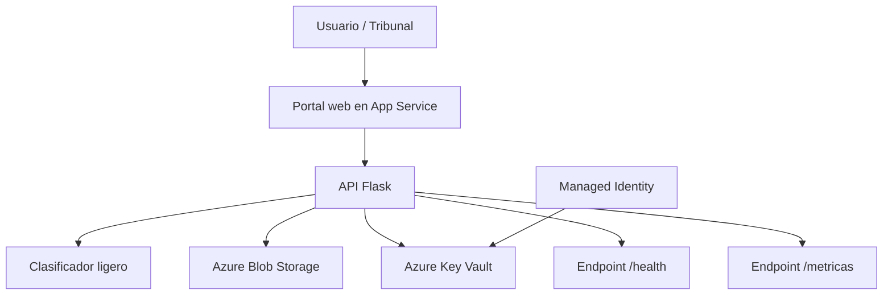
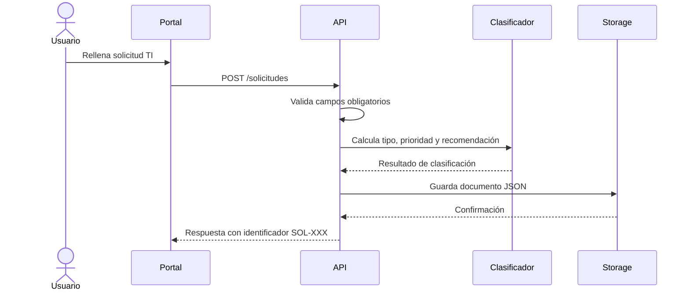
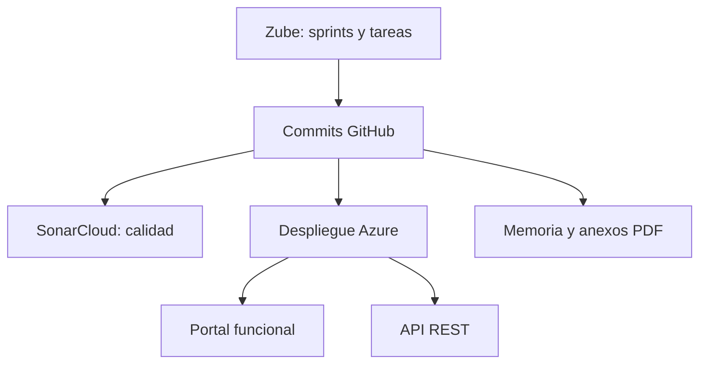

# Diagramas del sistema

Este documento recoge diagramas textuales en Mermaid para complementar las capturas y la arquitectura incluida en la memoria y los anexos. Los diagramas son de elaboración propia y reflejan el alcance final entregado: Azure App Service, Flask, Blob Storage, Key Vault, Managed Identity, Zube, SonarCloud y scripts PowerShell.

## Diagrama de componentes



## Flujo de creación de solicitud



## Despliegue y verificación

```mermaid
flowchart LR
    repo[Repositorio GitHub] --> script[deploy-azure.ps1]
    script --> azcli[Azure CLI]
    azcli --> app[Azure App Service]
    azcli --> kv[Azure Key Vault]
    azcli --> blob[Azure Blob Storage]
    verify[verify-azure.ps1] --> app
    verify --> endpoints[/, /health, /solicitudes, /metricas]
```

## Relación entre evidencias


