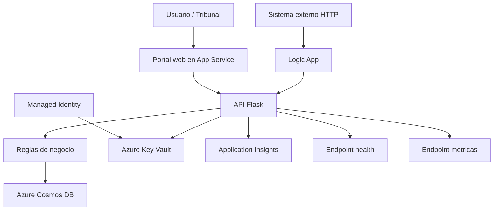
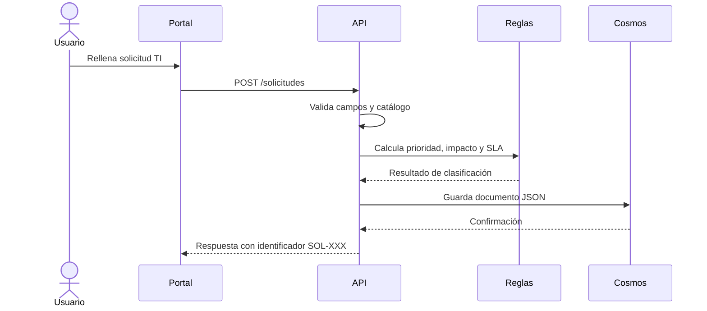
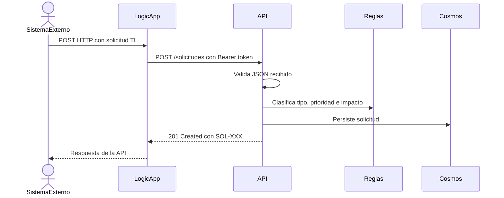
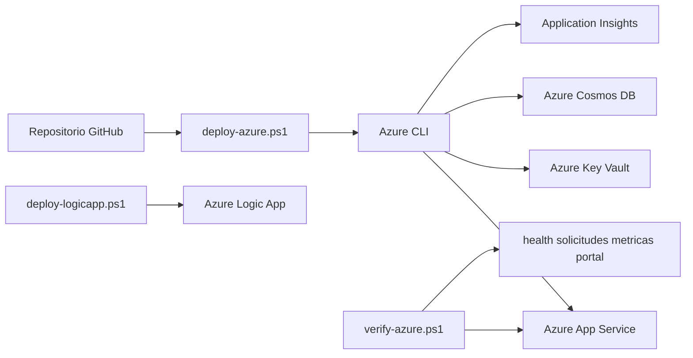
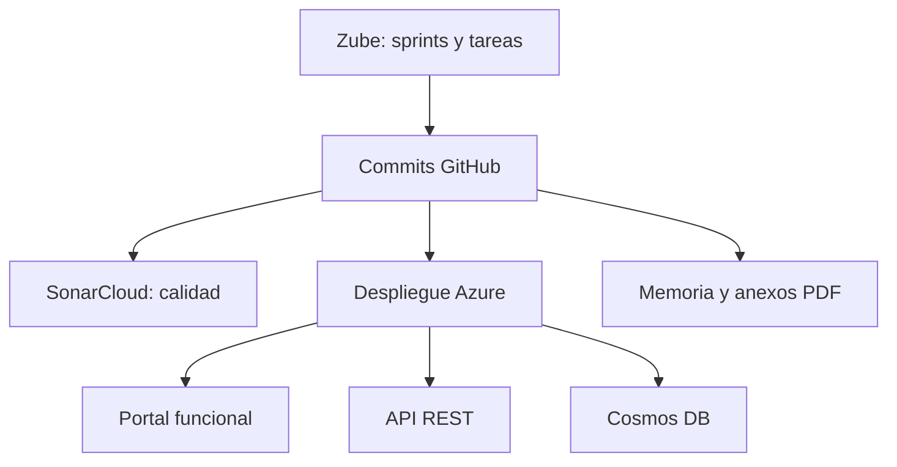

# Diagramas del sistema

La documentación visual del proyecto combina imágenes exportadas a `memoria/img/` y diagramas nativos en LaTeX. Los diagramas se han revisado para que coincidan con la arquitectura final: App Service, API Flask, Cosmos DB, Key Vault, Managed Identity, Logic App, Application Insights, Zube, GitHub y SonarCloud.

## Inventario

| Diagrama | Documento | Contenido |
|----------|-----------|-----------|
| `arquitectura_integral_tfg_azure.png` | README y memoria | Vista global de producto, Azure y evidencias de proceso. |
| `arquitectura_final_azure.png` | Memoria y Anexo C | Arquitectura cloud centrada en App Service, API, Cosmos DB, Key Vault, Logic App y Monitor. |
| `flujo_solicitud_ti.png` | Anexo C | Validación, clasificación, cálculo de impacto, persistencia y respuesta `SOL-XXX`. |
| `despliegue_azure.png` | Anexo D | Repositorio, PowerShell, Azure CLI, recursos de Azure y verificación. |
| `seguridad_secretos.png` | Memoria y Anexo C | Token en Key Vault, Managed Identity, HTTPS y endpoints protegidos. |
| `calidad_planificacion.png` | Anexos A y D | Relación entre Zube, GitHub, pruebas, SonarCloud y despliegue. |
| `logic_app_workflow.png` | Anexos C y D | Trigger HTTP, llamada a `POST /solicitudes` y respuesta al sistema externo. |
| `observabilidad_monitor.png` | Anexo D | Telemetría de App Service, Application Insights y Azure Monitor. |

Los modelos de casos de uso, entidades, estados y secuencias se generan directamente con TikZ en los anexos B y C. Todos los diagramas omiten tokens, cadenas de conexión y URLs firmadas.

## Diagrama de componentes

## Flujo de creación de solicitud

## Flujo de Logic App

## Despliegue y verificación

## Relación entre evidencias

