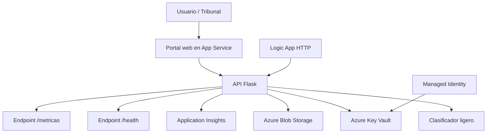
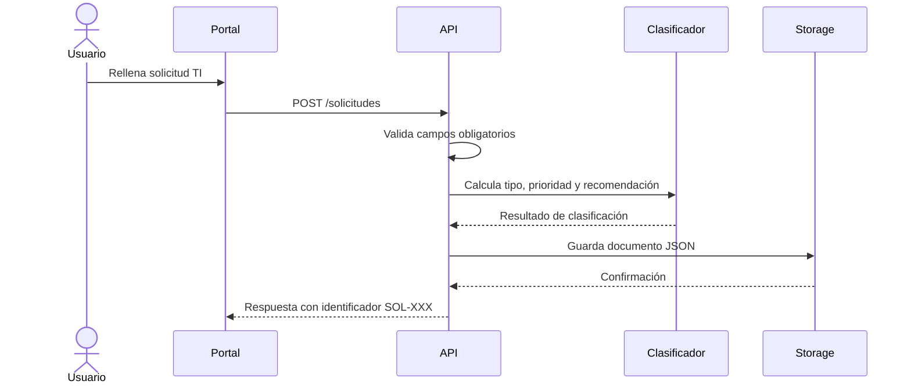
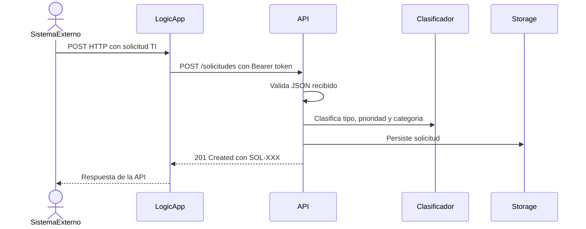
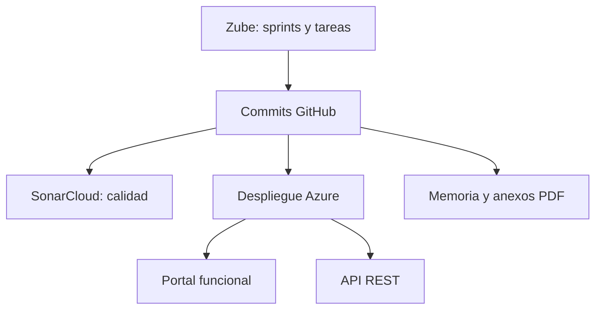

# Diagramas del sistema

La documentación visual del proyecto combina diagramas exportados a `memoria/img/` y modelos nativos en LaTeX. Los primeros representan la arquitectura general y las evidencias del despliegue; los segundos describen requisitos, entidades, estados y secuencias sin perder legibilidad al ampliar el PDF.

## Inventario

| Diagrama | Documento | Contenido |
|----------|-----------|-----------|
| `arquitectura_final_azure.png` | Memoria y Anexo C | Usuario, portal, App Service, API Flask, clasificador, Blob Storage, Key Vault, Managed Identity, Application Insights, Logic App, GitHub, Zube y SonarCloud. |
| `flujo_solicitud_ti.png` | Anexo C | Validación, clasificación, cálculo de impacto, persistencia y respuesta `SOL-XXX`. |
| `despliegue_azure.png` | Anexo D | Repositorio, PowerShell, Azure CLI, recursos de Azure y verificación de endpoints. |
| `seguridad_secretos.png` | Memoria y Anexo C | Token en Key Vault, acceso mediante Managed Identity, HTTPS y endpoints protegidos. |
| `calidad_planificacion.png` | Anexos A y D | Relación entre Zube, commits de GitHub, pruebas, SonarCloud y despliegue. |
| `logic_app_workflow.png` | Anexos C y D | Trigger HTTP, llamada a `POST /solicitudes` y respuesta al sistema externo. |
| `observabilidad_monitor.png` | Anexo D | Telemetría de App Service, Application Insights y Azure Monitor. |

Los modelos de casos de uso, entidades, estados y secuencias se generan directamente con TikZ en los anexos B y C. Todos los diagramas emplean nombres del despliegue real y omiten tokens, claves, cadenas de conexión y firmas de Logic Apps.
## Diagrama de componentes



## Flujo de creación de solicitud



## Flujo de Logic App



## Despliegue y verificación

```mermaid
flowchart LR
    repo[Repositorio GitHub] --> script[deploy-azure.ps1]
    script --> azcli[Azure CLI]
    azcli --> app[Azure App Service]
    azcli --> kv[Azure Key Vault]
    azcli --> blob[Azure Blob Storage]
    azcli --> ai[Application Insights]
    logic[deploy-logicapp.ps1] --> la[Azure Logic App]
    verify[verify-azure.ps1] --> app
    verify --> endpoints[/, /health, /solicitudes, /metricas]
```

## Relación entre evidencias



