# Evidencias finales del TFG

Esta carpeta contiene capturas propias utilizadas para demostrar que el prototipo existe, está desplegado, funciona y ha seguido un proceso de desarrollo controlado. Las imágenes complementan la memoria, los anexos y la defensa oral.

## 1. Recursos Azure desplegados

### Resource Group

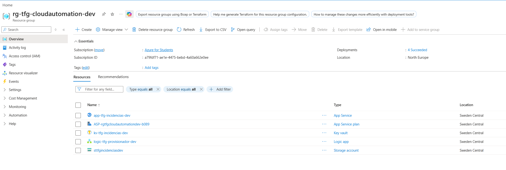

La captura muestra el grupo de recursos `rg-tfg-cloudautomation-dev` con los recursos principales del despliegue: App Service, Cosmos DB, Storage Account, Key Vault y App Service Plan. Sirve como evidencia de que la solución no es solo código local, sino una instancia real organizada en Azure.

### App Service

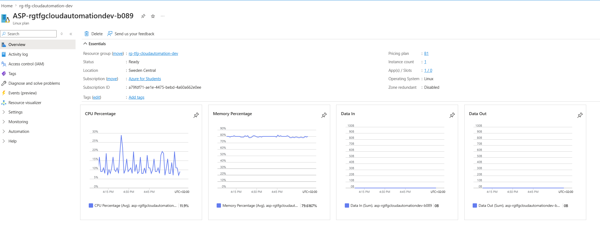

La captura recoge el App Service `app-tfg-incidencias-dev`, su estado operativo y la URL pública. Es la evidencia principal del despliegue web usado por el tribunal.

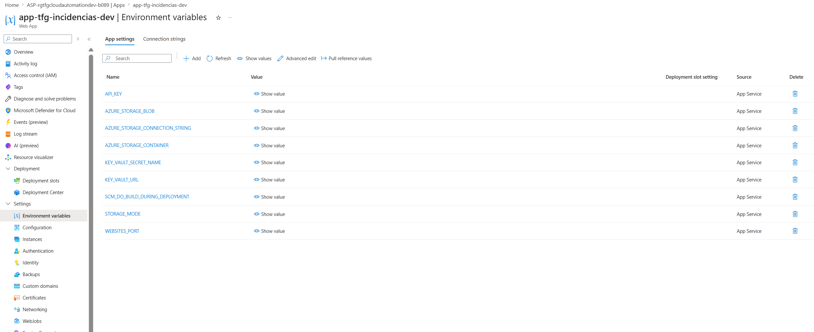

La captura muestra la configuración de la aplicación con variables como `STORAGE_MODE`, `COSMOS_ENDPOINT`, `KEY_VAULT_URL` y `AZURE_STORAGE_CONTAINER`; los valores sensibles permanecen ocultos.

### Identidad administrada

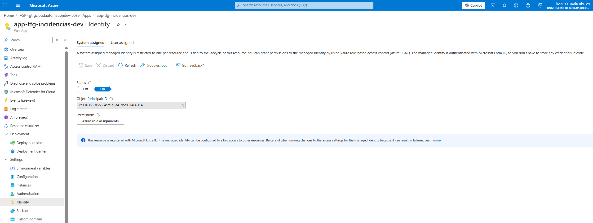

La identidad administrada del App Service permite acceder a Key Vault sin guardar credenciales en el código. La captura `azure-managed-identity - copia.png` es una copia de apoyo y no es necesaria para la entrega principal.

### Key Vault

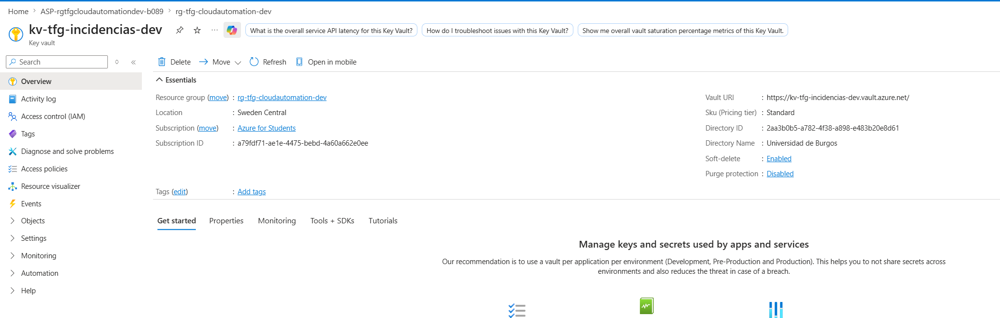

La captura muestra el Key Vault `kv-tfg-incidencias-dev`, usado para centralizar secretos.

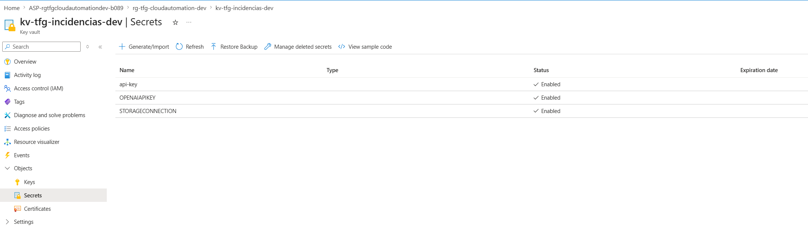

La captura evidencia la existencia del secreto `api-key` sin mostrar su valor. Se utiliza para justificar la separación de secretos respecto al repositorio.

### Storage Account

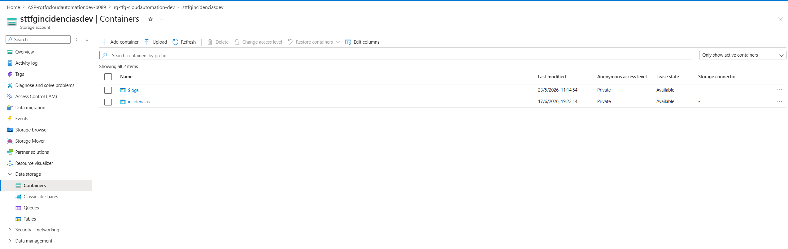

La captura muestra el Storage Account `sttfgincidenciasdev` y el contenedor `incidencias`.

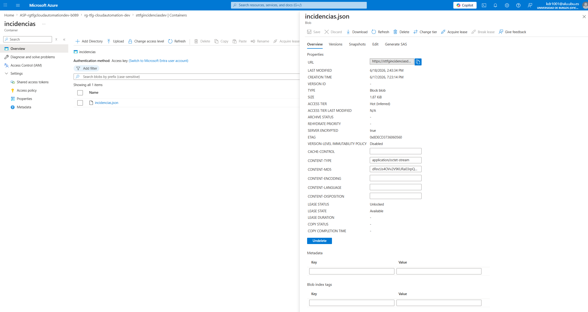

La captura muestra la base de datos Azure Cosmos DB usada para persistir las solicitudes como documentos JSON independientes. Es útil para explicar la evolución desde el blob inicial hacia una persistencia documental más adecuada para consultas y crecimiento.

## 2. Portal y API funcionando

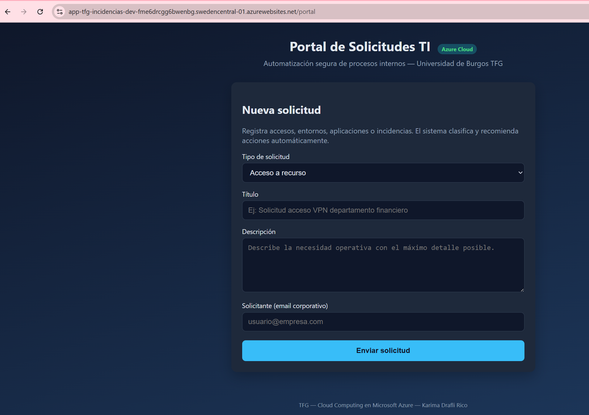

Pantalla del portal desplegado en `/portal`, con el formulario de solicitud TI.

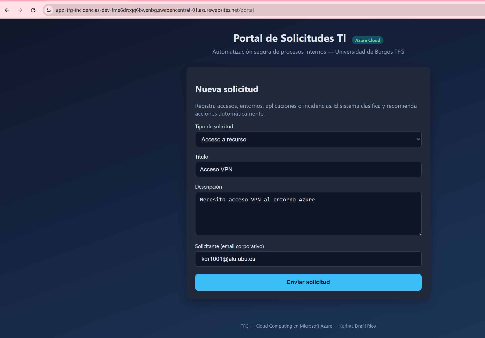

Evidencia funcional del envío de una solicitud desde el portal, incluida la respuesta con identificador, prioridad, clasificación y recomendación.

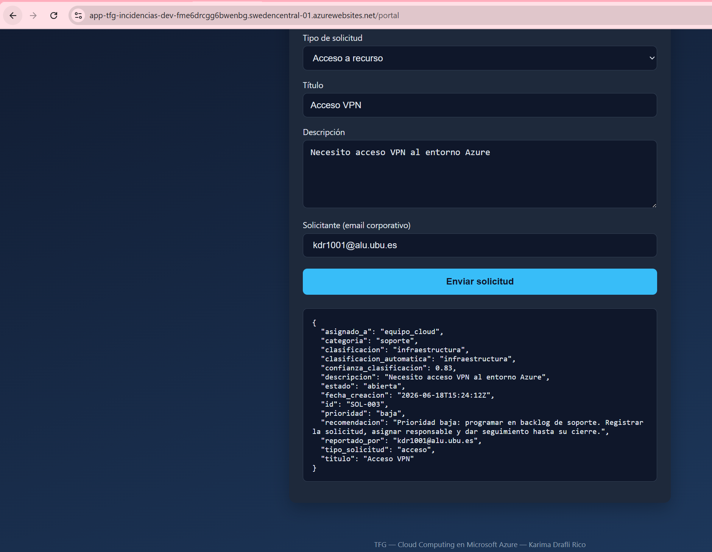

Variante de la evidencia anterior centrada en la respuesta JSON generada por la API.

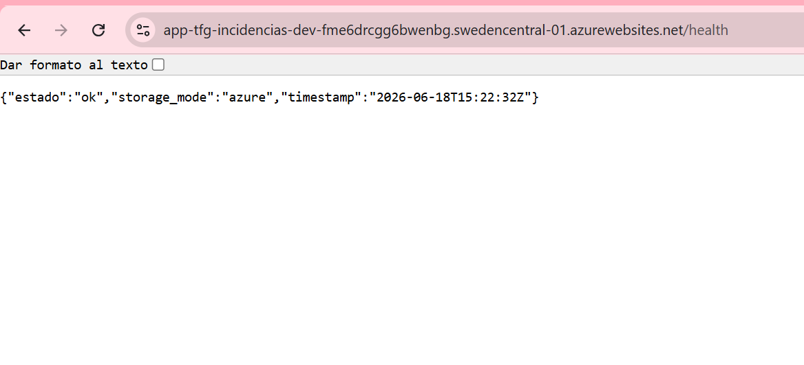

Captura de `/health`, mostrando que el servicio responde y que el modo de almacenamiento es `azure`.

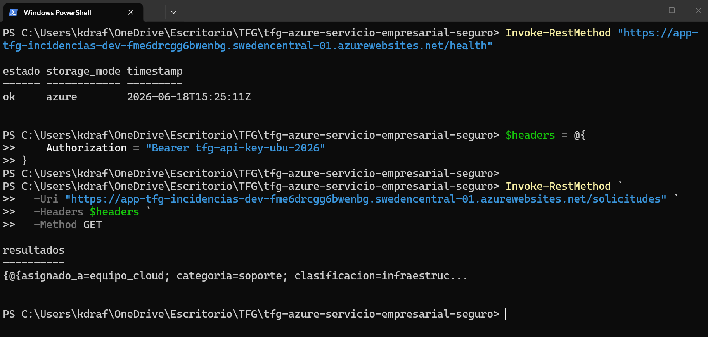

Evidencia de `GET /solicitudes` con autenticación Bearer. Demuestra que la consulta está protegida y devuelve datos reales.

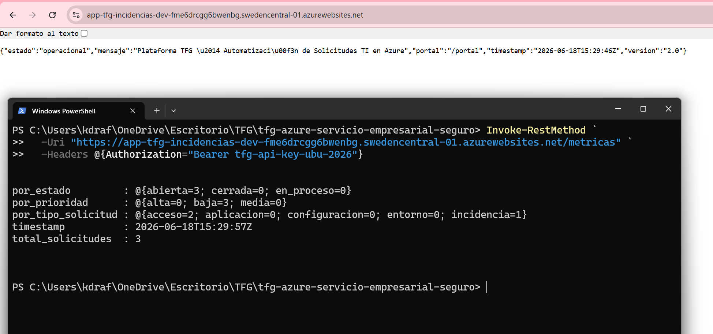

Evidencia de `GET /metricas`, con agregados por estado, prioridad y tipo de solicitud.

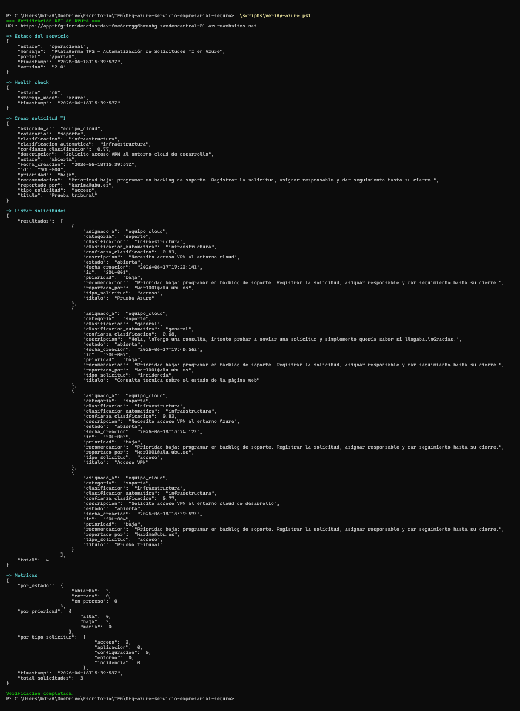

Salida de `scripts/verify-azure.ps1`, que valida automáticamente `/`, `/health`, creación de solicitud, listado y métricas.

### Funciones empresariales ampliadas

Las capturas incorporadas el 22 de junio documentan el incremento funcional posterior al gestor inicial de solicitudes:

- `portal-catalogo-servicios.png`: selección de servicio empresarial, activo afectado y entorno.
- `portal-solicitud-impacto.png`: resultado de la evaluación de impacto y asignación automática.
- `portal-solicitud-pendiente-aprobacion.png`: solicitud sensible detenida antes de su ejecución.
- `portal-escalado-solicitud.png`: controles de aprobación y escalado disponibles para el equipo TI.
- `portal-escalado-solicitud-aprobada.png`: decisión registrada con actor, fecha y trazabilidad.
- `portal-centro-operativo-sla.png`: carga por responsable, distribución por servicio y alertas activas.
- `portal-exportacion-csv.png`: exportación del informe operativo para su análisis externo.
- `portal-solicitudes-22junio.png`: bandeja consolidada después de las pruebas funcionales.
- `powershell-solicitud-evidenciacreada-v2.png`: detalle de una solicitud creada mediante el flujo automatizado.

### Demostración, ayuda y satisfacción

Las capturas del 23 de junio completan la evidencia de uso sin sustituir a las pruebas automáticas:

- `portal-demo-bandeja.png`: cinco casos idempotentes preparados para la demostración del tribunal.
- `portal-ayuda-final.png`: guía integrada que explica el recorrido funcional desde el propio producto.
- `documentacion-interactiva-de-API.png`: contrato OpenAPI navegable en Swagger UI.
- `openapi-swagger-final-ejecucion.png`: ejecución controlada de una operación desde la documentación.
- `documentacion-autorizacion-token.png` y `documentacion-autorizacion-despues-de-token.png`: autorización Bearer antes y después de introducir el token, siempre oculto.
- `portal-valoracion-final-solicitud-cerrada.png`: formulario habilitado únicamente tras el cierre.
- `portal-valoracion-final-recibido.png`: valoración aceptada y registrada en el historial.
- `portal-valoracion-final-enviado.png`: rechazo esperado de una segunda valoración sobre la misma solicitud.
- `portal-operaciones-satisfaccion.png`: agregado de respuestas y satisfacción media en el centro operativo.
- `portal-acerca-final.png`: versión candidata, arquitectura y enlaces públicos del proyecto.

Las evidencias versionadas ocultan claves, firmas `sig` y cadenas de conexión.

## 2.1. Automatizacion con Logic App

La Logic App `logic-tfg-solicitudes-dev` automatiza la entrada de solicitudes externas mediante un trigger HTTP y una llamada a la API desplegada en App Service. Las evidencias conservadas en esta carpeta son:

- `logic-app-workflow.png`: vista general del disenador con trigger HTTP, accion de creacion de solicitud y respuesta final.
- `logic-app-workflow-solicitud.png`: detalle del paso que envia la solicitud hacia `POST /solicitudes`.
- `logic-app-workflow-cliente.png`: detalle de la respuesta enviada al cliente que invoca el flujo.
- `logic-app-run-history.png`: historial de ejecucion correcto al enviar una solicitud.
- `logic-app-run-history-solicitud.png`: salida de la accion que crea la solicitud, con cabeceras sensibles ocultas.
- `logic-app-run-history-respondercliente.png`: respuesta final devuelta por la Logic App.
- `logic-app-workflow-final.png`: ejecución manual con un cuerpo que incluye servicio, activo y entorno.
- `logic-app-workflow-final-ejecucion.png`: definición desplegada del flujo HTTP hacia la API.
- `logic-app-request-evidencia.png`: solicitud automatizada visible en la bandeja del portal.

Estas evidencias documentan la automatización cloud del proceso empresarial sin exponer firmas `sig`, claves Bearer ni valores de secretos.

## 2.2. Observabilidad con Azure Monitor

Application Insights y Azure Monitor permiten justificar que el prototipo no solo se despliega, sino que tambien puede supervisarse durante su ejecucion.

Evidencias incorporadas para completar la observabilidad:

- `application-insights-overview.png`: vista general del recurso `appi-tfg-incidencias-dev`.
- `azure-monitor-metrics.png`: metricas del App Service o de Application Insights, por ejemplo peticiones, errores o tiempo de respuesta.

## 3. Calidad de código

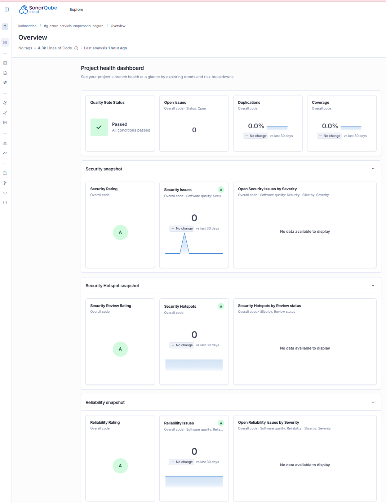

Captura final del Quality Gate aprobado en SonarCloud, con cero problemas abiertos, seguridad A, fiabilidad A, cero hotspots y duplicación del 0,0 %. La cobertura figura al 0,0 % porque el análisis web no recibió el informe generado por las pruebas locales.

Evidencias finales incorporadas:

- `sonarcloud-quality-gate-final-20junio.png`: estado intermedio, con Quality Gate aprobado, seguridad A y ocho cuestiones de mantenibilidad.
- `sonarcloud-quality-gate-final-22junio.png`: análisis posterior a la ampliación, con Quality Gate aprobado y cero issues abiertos.
- `sonarcloud-quality-gate-final-23junio.png`: analisis tras demostracion, OpenAPI y satisfaccion, con Quality Gate aprobado, cero problemas abiertos y calificaciones A.
- `sonarcloud-quality-gate-final-30junio.png`: análisis final tras la migración a Cosmos DB, con Quality Gate aprobado y la solución ya alineada con la persistencia documental final.

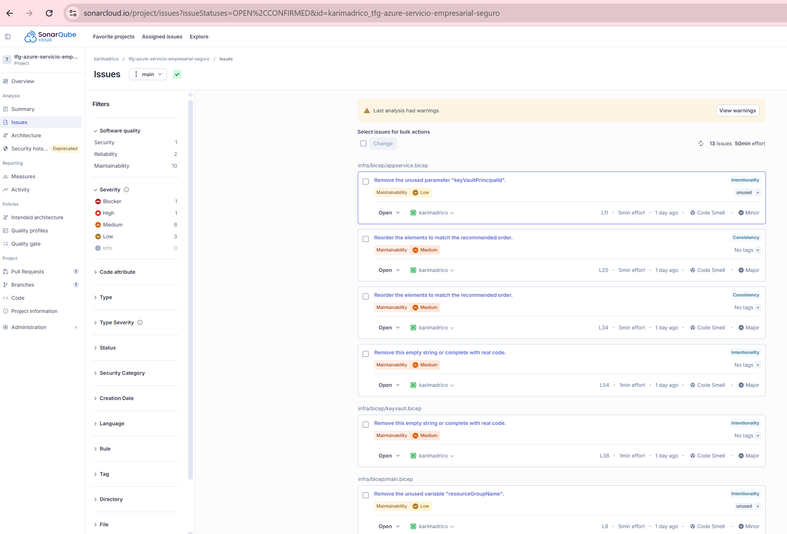

Resumen de issues y calificaciones de SonarCloud. Sirve para explicar qué se corrigió y qué queda como mejora posterior.

## 4. Seguimiento del proyecto

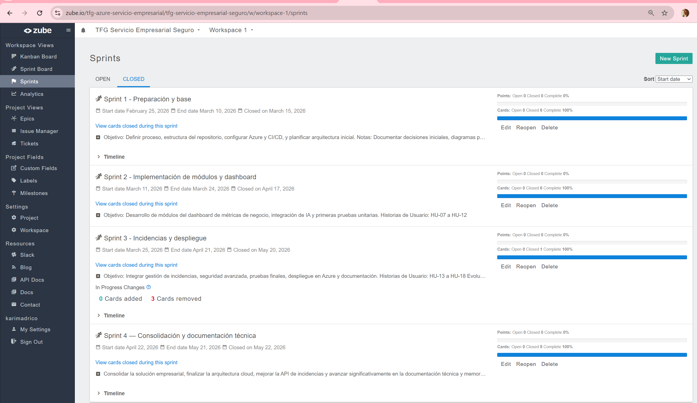

Evidencia de sprints cerrados en Zube. Para más detalle del seguimiento por iteraciones se conserva además la carpeta `docs/sprints/`, con capturas históricas y el resumen de sprints.

Vista consolidada de los cinco sprints cerrados. Zube registra 114 puntos cerrados y conserva 18 puntos retirados del Sprint 3, por lo que el backlog estimado completo suma 132 puntos.

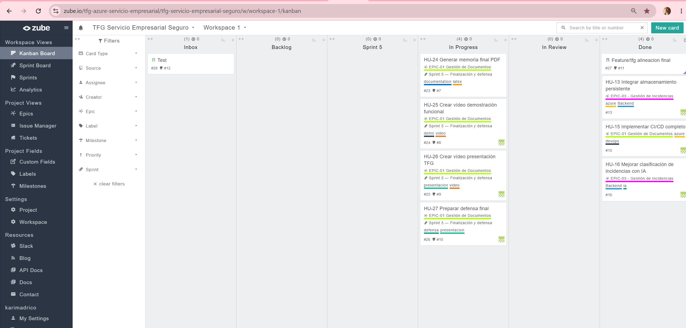

Vista del tablero Kanban final, útil para demostrar el estado del trabajo en la defensa.

## 5. Repositorio y entrega

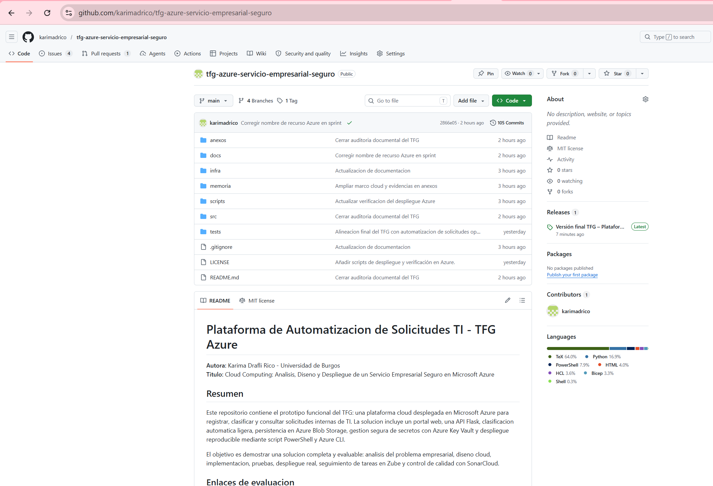

Captura de la página principal del repositorio en GitHub, mostrando que el README funciona como landing page del proyecto.

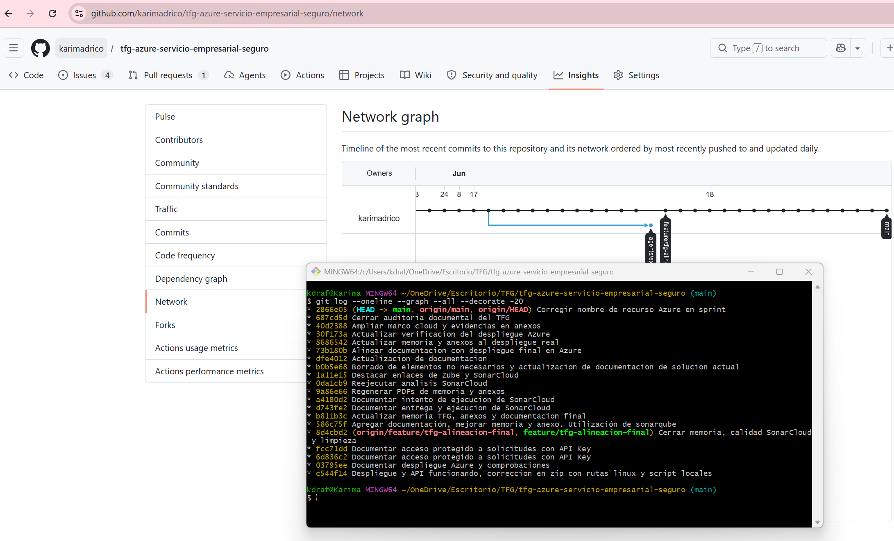

Evidencia del historial de commits y de la trazabilidad del desarrollo.

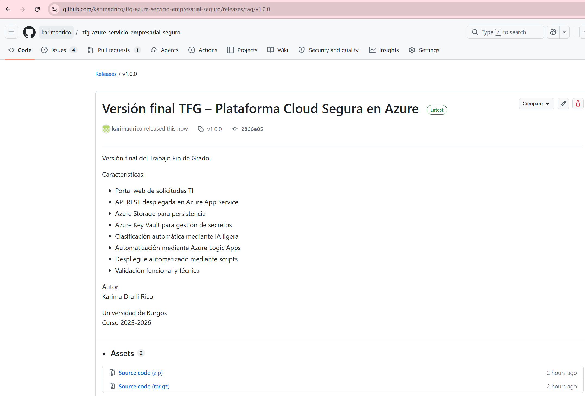

Captura de la release `v1.0.0`, conservada como evidencia histórica. La versión candidata actual se distribuye como `v1.1.0` y su enlace figura en el README principal.

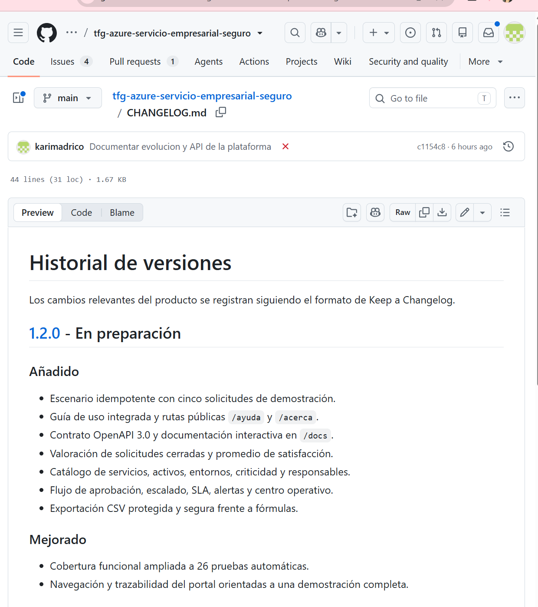

El changelog resume los incrementos funcionales que condujeron a la versión candidata.

## 6. Material de defensa

`cartel-a3-final.png` es la representación visual del cartel A3 compilado en `docs/entrega/cartel-a3.pdf`. Resume el problema, la arquitectura Azure, el flujo de solicitudes, la seguridad y la validación; también se incluye en los anexos oficiales.

## 7. Capturas complementarias

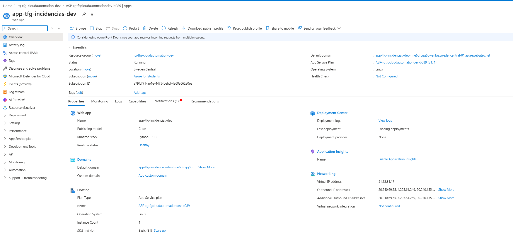

Captura complementaria de la aplicación web en Azure.

Captura adicional del portal público usado para la demostración.

## Base de datos Azure Cosmos DB

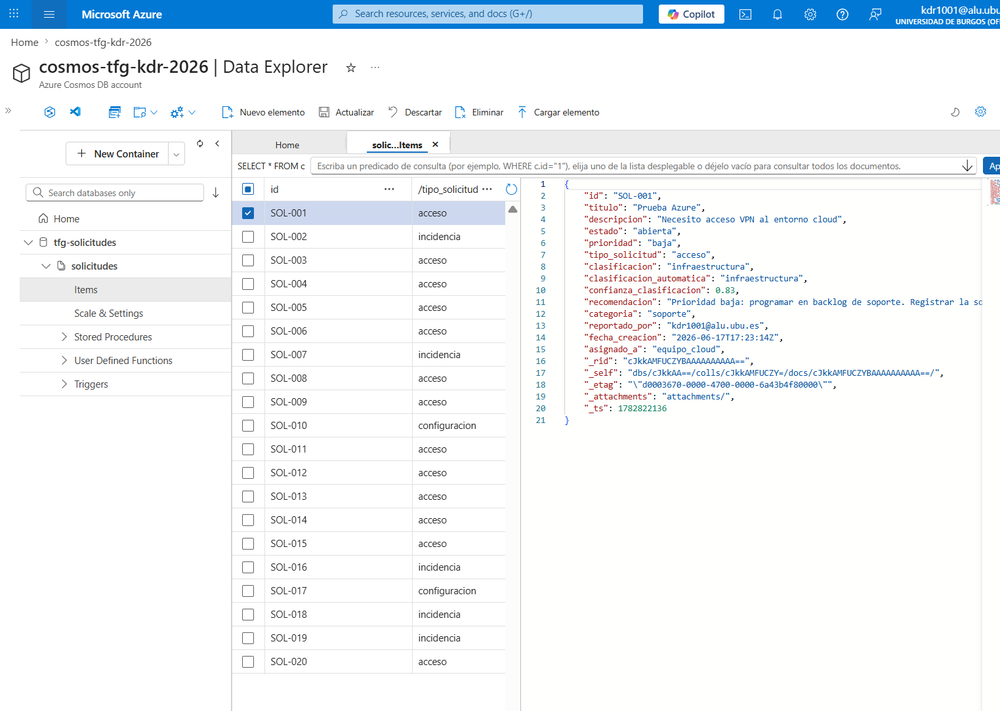

La captura muestra la cuenta `cosmos-tfg-kdr-2026`, la base de datos `tfg-solicitudes` y el contenedor `solicitudes`, utilizado como persistencia documental final del prototipo. La partición configurada es `/tipo_solicitud`. Esta evidencia complementa la migración desde Blob Storage y confirma que las solicitudes se conservan como documentos independientes en Azure Cosmos DB.
