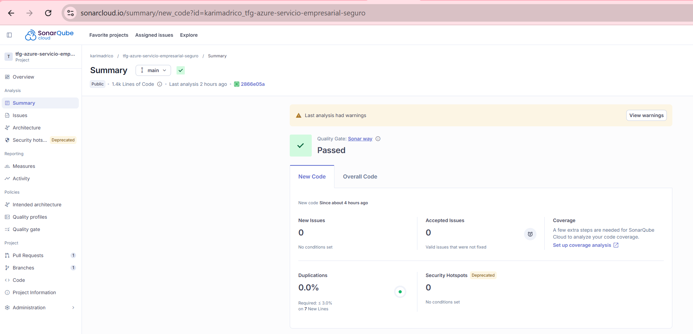
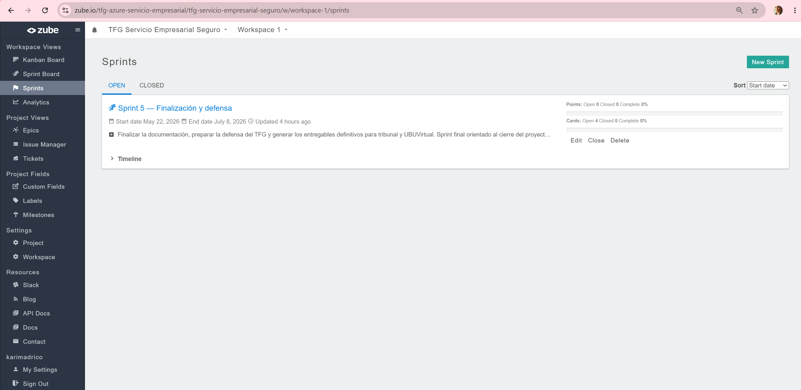

# Evidencias finales del TFG

Esta carpeta contiene capturas propias utilizadas para demostrar que el prototipo existe, está desplegado, funciona y ha seguido un proceso de desarrollo controlado. Las imágenes complementan la memoria, los anexos y la defensa oral.

## 1. Recursos Azure desplegados

### Resource Group

La captura muestra el grupo de recursos `rg-tfg-cloudautomation-dev` con los recursos principales del despliegue: App Service, Storage Account, Key Vault y App Service Plan. Sirve como evidencia de que la solución no es solo código local, sino una instancia real organizada en Azure.

### App Service

La captura recoge el App Service `app-tfg-incidencias-dev`, su estado operativo y la URL pública. Es la evidencia principal del despliegue web usado por el tribunal.

La captura muestra la configuración de la aplicación con variables como `STORAGE_MODE`, `KEY_VAULT_URL` y `AZURE_STORAGE_CONTAINER`. No debe exponer valores secretos completos; su objetivo es evidenciar la configuración cloud.

### Identidad administrada

La identidad administrada del App Service permite acceder a Key Vault sin guardar credenciales en el código. La captura `azure-managed-identity - copia.png` es una copia de apoyo y no es necesaria para la entrega principal.

### Key Vault

La captura muestra el Key Vault `kv-tfg-incidencias-dev`, usado para centralizar secretos.

La captura evidencia la existencia del secreto `api-key` sin mostrar su valor. Se utiliza para justificar la separación de secretos respecto al repositorio.

### Storage Account

La captura muestra el Storage Account `sttfgincidenciasdev` y el contenedor `incidencias`.

La captura muestra el blob JSON usado para persistir las solicitudes. Es útil para explicar el modelo documental empleado en lugar de una base de datos relacional.

## 2. Portal y API funcionando

Pantalla del portal desplegado en `/portal`, con el formulario de solicitud TI.

Evidencia funcional del envío de una solicitud desde el portal. Debe verse la respuesta con identificador, prioridad, clasificación y recomendación.

Variante de la evidencia anterior centrada en la respuesta JSON generada por la API.

Captura de `/health`, mostrando que el servicio responde y que el modo de almacenamiento es `azure`.

Evidencia de `GET /solicitudes` con autenticación Bearer. Demuestra que la consulta está protegida y devuelve datos reales.

Evidencia de `GET /metricas`, con agregados por estado, prioridad y tipo de solicitud.

Salida de `scripts/verify-azure.ps1`, que valida automáticamente `/`, `/health`, creación de solicitud, listado y métricas.

## 3. Calidad de código

Captura del Quality Gate aprobado en SonarCloud. Es la evidencia principal para el criterio de calidad interna.

Resumen de issues y calificaciones de SonarCloud. Sirve para explicar qué se corrigió y qué queda como mejora posterior.

## 4. Seguimiento del proyecto

Evidencia de sprints cerrados en Zube. Para más detalle del seguimiento por iteraciones se conserva además la carpeta `docs/sprints/`, con capturas históricas y el resumen de sprints.

Evidencia del Sprint 5 orientado al cierre de memoria, anexos, vídeos, release y entrega.

Vista del tablero Kanban final, útil para demostrar el estado del trabajo en la defensa.

## 5. Repositorio y entrega

Captura de la página principal del repositorio en GitHub, mostrando que el README funciona como landing page del proyecto.

Evidencia del historial de commits y de la trazabilidad del desarrollo.

Captura de la release final `v1.0.0`, utilizada para distribuir el estado entregado del repositorio.

## 6. Capturas complementarias

Captura complementaria de la aplicación web en Azure.

Captura adicional del portal público usado para la demostración.
