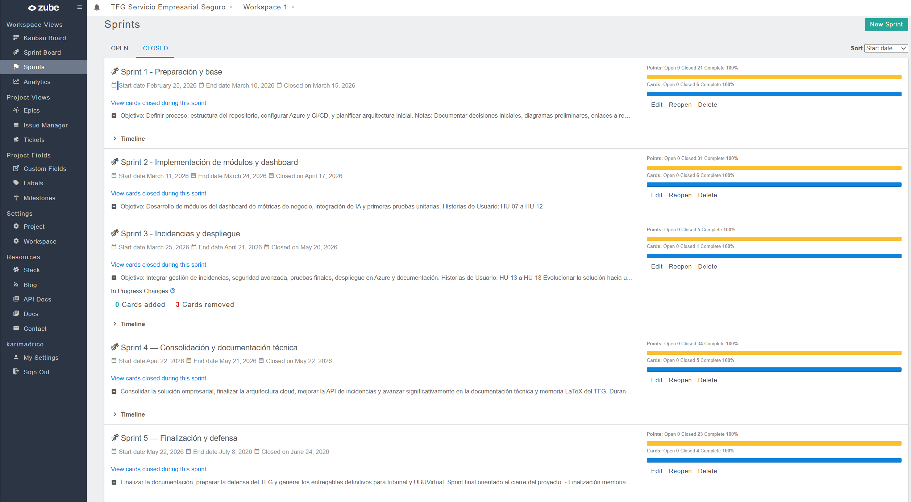

# Resumen de sprints en Zube

Tablero: https://zube.io/tfg-azure-servicio-empresarial/tfg-servicio-empresarial-seguro/w/workspace-1/kanban

| Sprint | Fechas | Estado | Puntos | Objetivo |
|--------|--------|--------|-------:|----------|
| Sprint 1 - Preparación y base | 25/02/2026 - 10/03/2026 | Cerrado 15/03/2026 | 21 | Definir proceso, repositorio, Azure inicial, validación inicial y arquitectura base. |
| Sprint 2 - Implementación de módulos y dashboard | 11/03/2026 - 24/03/2026 | Cerrado 17/04/2026 | 31 | Desarrollar módulos, dashboard, clasificación por reglas y primeras pruebas unitarias. |
| Sprint 3 - Incidencias y despliegue | 25/03/2026 - 21/04/2026 | Cerrado 20/05/2026 | 23 | Integrar incidencias, seguridad, pruebas finales y despliegue Azure. |
| Sprint 4 - Consolidación y documentación técnica | 22/04/2026 - 21/05/2026 | Cerrado 22/05/2026 | 34 | Consolidar arquitectura cloud, API, documentación técnica, anexos y evidencias. |
| Sprint 5 - Finalización y defensa | 22/05/2026 - 24/06/2026 | Cerrado 24/06/2026 | 23 | Cerrar memoria/anexos, calidad, validación final y preparar defensa y entregables. |

## Evidencias

Las capturas de Zube se conservan en `docs/sprints/` y permiten comprobar la evolución incremental del proyecto. Los cinco sprints están cerrados; el último se cerró el 24 de junio de 2026 con sus cuatro tarjetas y 23 puntos completados.

La vista final muestra los 114 puntos cerrados en Zube. El backlog completo suma 132 puntos al incluir los 18 puntos retirados del Sprint 3 durante la replanificación. Las capturas `sprint1-final.png`, `sprint2-final.png`, `sprint3-final.png`, `sprint3-final-retiradas.png`, `sprint4-final.png` y `sprint5-final.png` permiten revisar cada iteración por separado.

El inventario de tarjetas, enlaces y decisiones de replanificación se encuentra en [`zube-detalle.md`](zube-detalle.md).

## Estimación relativa

El backlog utiliza una escala Fibonacci para comparar complejidad, incertidumbre y dependencias. En el Sprint 3 se comprometieron 23 puntos: 5 se cerraron dentro de la iteración y 18 se retiraron durante la replanificación. La asignación por historia y el tratamiento de esos cambios se detallan en [`criterio-estimacion.md`](criterio-estimacion.md).
