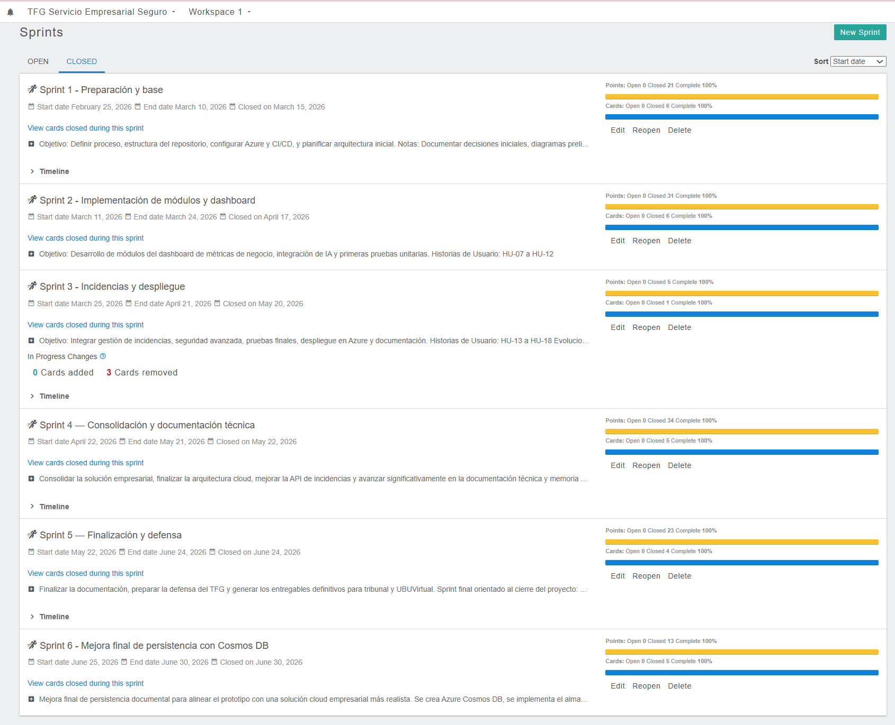

# Seguimiento detallado en Zube

Tablero principal: https://zube.io/tfg-azure-servicio-empresarial/tfg-servicio-empresarial-seguro/w/workspace-1/kanban

Este documento resume las historias registradas en Zube, su objetivo y el resultado aportado al producto. Las capturas de cada sprint se conservan en esta misma carpeta.

## Sprint 1 - Preparación y base

Objetivo: definir el proceso empresarial, estructurar el repositorio, preparar Azure, planificar la arquitectura y configurar el seguimiento inicial de calidad.

| Tarjeta | Historia de usuario | Resultado aportado |
|---------|--------------------|--------------------|
| #1 | HU-01 Definir proceso empresarial a automatizar | Se delimitó el caso de negocio: solicitudes internas de TI con trazabilidad, prioridad y seguridad. |
| #2 | HU-02 Configurar cuenta de Azure Students | Se preparó la suscripción usada para desplegar los recursos del prototipo. |
| #3 | HU-03 Estructurar repositorio y plantillas LaTeX | Se creó la estructura base de código, documentación y memoria. |
| #4 | HU-04 Explorar CI/CD básico | Se evaluó automatización inicial; el despliegue final se resolvió con PowerShell y Azure CLI. |
| #5 | HU-05 Diseñar arquitectura general | Se definió la arquitectura inicial con App Service, seguridad y persistencia gestionada. |
| #6 | HU-06 Configurar seguimiento de calidad | Se incorporó SonarCloud como herramienta externa de revisión. |

## Sprint 2 - Implementación de módulos y dashboard

Objetivo: desarrollar API, gestión de incidencias, seguridad inicial, clasificación ligera y primeras pruebas.

| Tarjeta | Historia de usuario | Resultado aportado |
|---------|--------------------|--------------------|
| #7 | HU-07 Crear Azure Key Vault | Se preparó el almacén de secretos para separar credenciales del código fuente. |
| #8 | HU-08 Integrar Key Vault con App Service | Se vinculó la aplicación desplegada con la gestión segura de secretos. |
| #9 | HU-09 Crear API Python inicial | Se implementó la base de la API Flask y sus endpoints principales. |
| #10 | HU-10 Explorar GitHub Actions | Se probó la vía de CI/CD y se documentó su sustitución por scripts reproducibles. |
| #11 | HU-11 Crear sistema de incidencias | Se construyó el flujo inicial de registro y consulta de solicitudes. |
| #12 | HU-12 Integrar clasificación de incidencias | Se incorporó clasificación ligera basada en reglas explicables. |

## Sprint 3 - Incidencias y despliegue

Objetivo: consolidar seguridad, persistencia, clasificación y despliegue del prototipo.

| Tarjeta | Historia de usuario | Resultado aportado |
|---------|--------------------|--------------------|
| #13 | HU-13 Integrar almacenamiento persistente | Se replanificó y evolucionó primero a Blob Storage y finalmente a Cosmos DB. |
| #14 | HU-14 Consolidar Key Vault | Se reforzó el uso del secreto `api-key` fuera del repositorio. |
| #15 | HU-15 Implementar CI/CD completo | Se descartó del alcance final y se sustituyó por despliegue reproducible con scripts. |
| #16 | HU-16 Mejorar clasificación | Se incorporó posteriormente como clasificador determinista con pruebas. |

## Sprint 4 - Consolidación y documentación técnica

Objetivo: consolidar arquitectura, infraestructura como código, API, memoria, anexos y evidencias.

| Tarjeta | Historia de usuario | Resultado aportado |
|---------|--------------------|--------------------|
| #18 | HU-19 Integrar Terraform | Se documentó infraestructura reproducible como apoyo al diseño cloud. |
| #19 | HU-20 Documentar arquitectura cloud | Se generaron diagramas, decisiones y evidencias de Azure. |
| #20 | HU-21 Completar memoria LaTeX | Se avanzó la memoria y anexos técnicos. |
| #21 | HU-22 Mejorar API empresarial | Se ampliaron endpoints y comportamiento operativo. |
| #22 | HU-23 Preparar evidencias técnicas | Se recopilaron capturas de Azure, portal, calidad y despliegue. |

## Sprint 5 - Finalización y defensa

Objetivo: cerrar documentación, validación, defensa y entrega oficial.

| Tarjeta | Historia de usuario | Prioridad | Puntos | Resultado aportado |
|---------|--------------------|:---------:|-------:|--------------------|
| #23 | HU-24 Generar memoria final PDF | P1 | 8 | Se generaron memoria y anexos con índices, figuras, tablas y bibliografía. |
| #24 | HU-25 Crear vídeo de demostración | P1 | 5 | Se preparó el recorrido funcional que se grabará para UBUVirtual. |
| #25 | HU-26 Crear vídeo de presentación | P1 | 5 | Se preparó la exposición apoyada en presentación visual. |
| #26 | HU-27 Preparar defensa final | P1 | 5 | Se organizó material de defensa, release, README y evidencias. |

## Sprint 6 - Mejora final de persistencia con Cosmos DB

Objetivo: evolucionar la persistencia final a Azure Cosmos DB, migrar las solicitudes existentes y actualizar evidencias/documentación.

| Tarjeta | Historia de usuario | Prioridad | Puntos | Resultado aportado |
|---------|--------------------|:---------:|-------:|--------------------|
| HU-28 | Crear Cosmos DB Free Tier | P1 | 3 | Se creó la cuenta `cosmos-tfg-kdr-2026`, base `tfg-solicitudes` y contenedor `solicitudes`. |
| HU-29 | Implementar almacenamiento en Cosmos DB | P1 | 5 | Se añadió almacenamiento documental y `STORAGE_MODE=cosmos`. |
| HU-30 | Migrar solicitudes desde Blob Storage | P1 | 2 | Se migraron 20 solicitudes existentes conservando estructura e historial. |
| HU-31 | Verificar despliegue real con Cosmos DB | P1 | 2 | Se comprobó `/health`, creación, listado y métricas con Cosmos DB activo. |
| HU-32 | Actualizar evidencias y documentación final | P2 | 1 | Se actualizaron README, diagramas, memoria, anexos, SonarCloud y release `v1.2.0`. |

## Estimación relativa

Las historias usan escala Fibonacci `1, 2, 3, 5, 8 y 13`. El backlog suma 145 puntos estimados: 127 puntos cerrados dentro de los sprints y 18 puntos retirados del Sprint 3 durante la replanificación. La distribución completa se detalla en `criterio-estimacion.md`.

